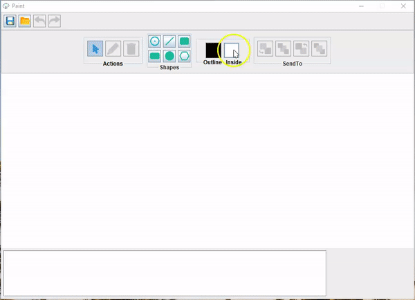

# PaintDO
 A simple Paint simulation MVC application for creating drawings. Developed with the goal of learning/practicing the use of various design patterns and OOP.

 ## Features: 
 -drawing shapes (point, line, rectangle, square, circle, hexagon) 
 -editing shapes 
 -deleting shapes 
 -undo 
 -redo 
 -bring to back 
 -bring to front 
 -save/load drawings 
 ### Demo:   

